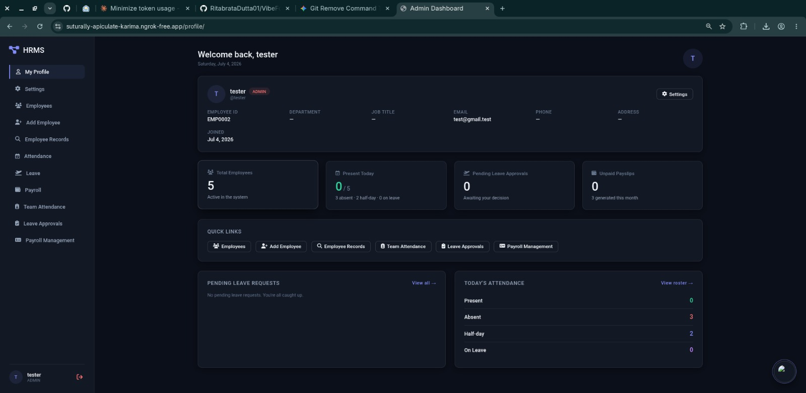
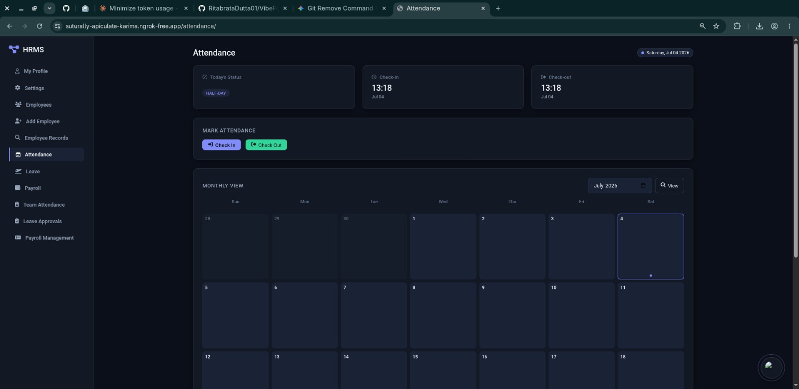

# 🚀 HR Management System

A modern **HR Management System** built with **Django** to simplify employee management, attendance tracking, payroll, and leave approvals through dedicated HR and Employee dashboards.

---

## ✨ Features

### 👨‍💼 HR Dashboard
- Employee Management
- Attendance Tracking
- Payroll Management
- Leave Approval System
- Employee Search
- Dashboard Analytics

### 👨‍💻 Employee Dashboard
- View Attendance
- Apply for Leave
- Track Leave Status
- View Payroll Details
- Personal Dashboard

---

## 🛠 Tech Stack

- **Backend:** Django
- **Frontend:** HTML, CSS, JavaScript
- **Database:** SQLite
- **Language:** Python

---

## 📂 Project Structure

```
accounts/
attendance/
leaves/
payroll/
hrms/
media/
screenshots/
manage.py
```

---

## ⚙️ Installation

```bash
git clone https://github.com/your-username/VibeForge.git

cd VibeForge

python -m venv venv

# Windows
venv\Scripts\activate

# Linux/Mac
source venv/bin/activate

pip install -r requirements.txt

python manage.py migrate

python manage.py runserver
```

Visit

```
http://127.0.0.1:8000
```

---

# 📸 Screenshots

## Dashboard



---

## Employee Dashboard


---

## Attendance



---

## Employee Search


---

## New Employee


---

## Leave Request


---

## Leave Approvals


---

# 📌 Modules

- Employee Management
- Attendance
- Payroll
- Leave Management
- Authentication
- HR Dashboard
- Employee Dashboard

---

# 👥 Team VibeForge

- **Aditya Tiwari**
- **Ritabrata Dutta**
- **Soumyadeep Dutta**
- **Suman Mondal**

---

## 🎯 Future Improvements

- Email Notifications
- PDF Payslips
- Role-Based Permissions
- Performance Analytics
- Salary Reports
- Employee Profile Pictures
- Dark Mode

---

## 📜 License

This project was developed for academic purposes by **Team VibeForge**.
